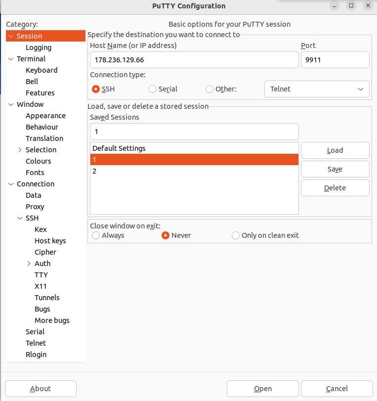
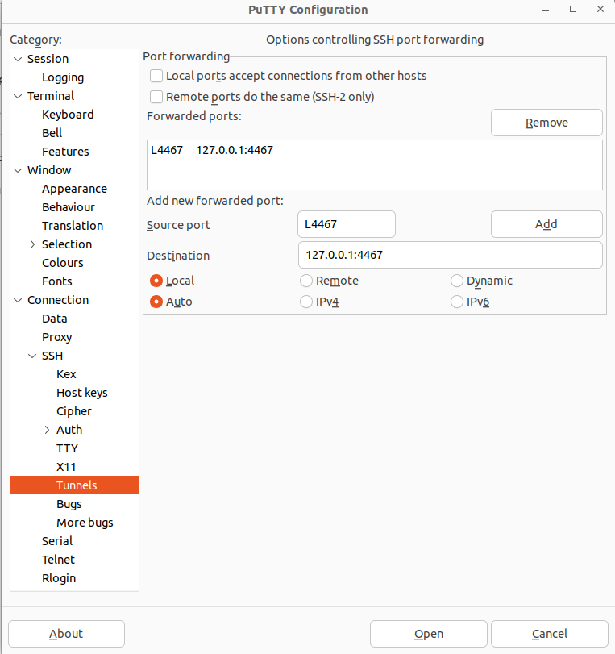
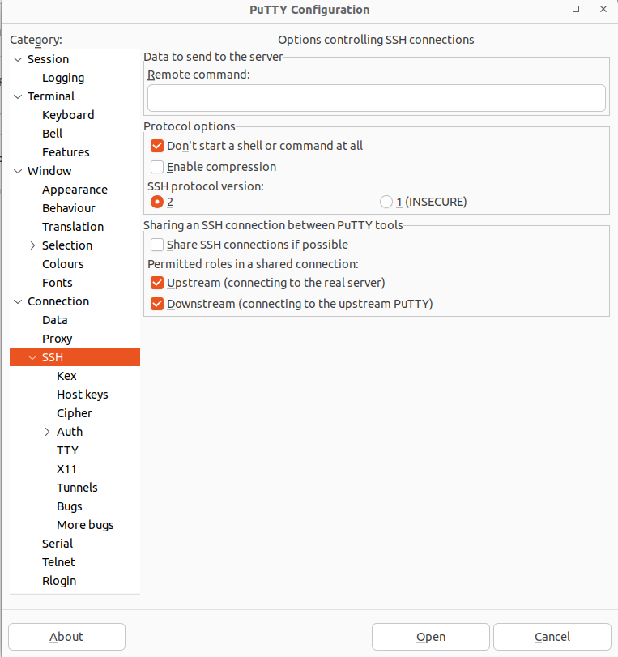
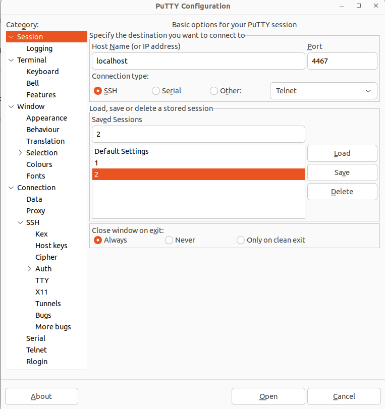

# SIR

## День 1

[Тест](https://forms.gle/GoyBXXhZoMLRMqHn8) \
[Слайды](https://drive.google.com/file/d/1IcUxNHQXTq95t22ifQjz25zELyC-imKu/view?usp=drive_link) \


### Установка R, RStudio и tidyverse

R \
https://cran.rstudio.com/ 

RStudio \
https://posit.co/download/rstudio-desktop/

```
install.packages('tidyverse')
```


### Данные 

Palmer Archipelago (Antarctica) penguin data 
[csv](day_1/pen.csv) \
[xlsl](day_1/pen.xlsx)

## День 2

Код за первый и второй дни \
[код](https://drive.google.com/file/d/1-rvv18X4_mQRPFB7AGf31BAigVMt0Wp-/view?usp=drive_link)

## День 3

[Тест](https://forms.gle/a2dgQFz3VxA6FEXx6) \
[Слайды](https://drive.google.com/file/d/1ShbQdLotbEyXouvxprDBXbNNfndQk_Xm/view?usp=drive_link) \
[Шпаргалки](https://drive.google.com/drive/folders/1HUZpQ134Lslgwk6PyDCx8kWG-y-M1fqP?usp=drive_link)

### DADA2

[установка](https://benjjneb.github.io/dada2/dada-installation.html) \
[туториал](https://benjjneb.github.io/dada2/tutorial.html)

### Датасет "Пулково"

[сырые прочтения](https://drive.google.com/drive/folders/1aPG0GG-GavigjMnm24rXRXshLe_QicmQ?usp=drive_link) \
[Silva - основная база](https://drive.google.com/file/d/17nyri0PXN-DxyR-j4Czqd6Xs0rGAU2hS/view?usp=drive_link) \
[Silva - виды](https://drive.google.com/file/d/1FHfrlQjzbKXGVDIIvbRdgfIJpprSniaG/view?usp=drive_link) \
[Папка с промежуточными переменными, если у кого-то не хватит оперативной памяти](https://drive.google.com/drive/folders/1tef4_nzs_70JGtbfjn4TLzPKURyQCl4y?usp=drive_link) \
[метаданные](day_3/map.csv)

Библиотеки с которыми сы сегодня будем работать:
- dada2
- phyloseq


## День 4-5

Код по работе с phyloseq \
[код](day_4/pulkovo.html) \
[Слайды](https://drive.google.com/file/d/1QN5PWtlcIVRnw89zFDMYg-dm2fSyUQaT/view?usp=drive_link)

Полный датасет по Пулково \
[ps.ff](day_4/ps.ff) \
Функция bargraph.R \
[bargraph.R](day_4/bargraph.R) 

Установка пакетов: 
- ggpubr есть в CRAN \
- ampvis2 надо ставить из гитхаба:

```
install.packages(“remotes”)
remotes::install_github(“kasperskytte/ampvis2”)
```

Дополнительно 

QIIME 2 - базовый туториал: \
[ссылка](https://docs.qiime2.org/2023.9/tutorials/moving-pictures/) \
ampvis2 - библиотека для визуализации: \
[ссылка](https://kasperskytte.github.io/ampvis2/articles/ampvis2.html) \
phyloseq - визуализация и организация даннных: \
[ссылка](https://joey711.github.io/phyloseq/) \
Приятный курс - глава где написано как статистически сравнивать представленность: \
[ссылка](https://microbiome.github.io/course_2021_radboud/differential-abundance-analysis.html) \
vegan - статистика для экологии, много отдельных материалов, phyloseq работает на его базе \
[ссылка](https://cloud.r-project.org/web/packages/vegan/vignettes/FAQ-vegan.html)

## День 6-7

[Тест](https://forms.gle/ZMx1ejJ8QjF4wrs57)
[Слайды](https://drive.google.com/file/d/1mwGF-GUjrP6k7Unp3AMmxkYmt7LvlaXb/view?usp=drive_link)

### Подключение к уделенному серверу

#### Вариант 1 - через терминал Windows

Установка openssh на Windows \
В PowerShell с правами администратора: 

```
Get-WindowsCapability -Online | Where-Object Name -like ‘OpenSSH.Server*’ | Add-WindowsCapability –Online
```
или

```
dism /Online /Add-Capability /CapabilityName:OpenSSH.Server~~~~0.0.1.0
```

Проверить установку:

```
Get-WindowsCapability -Online | ? Name -like 'OpenSSH.Ser*'
```
Прокинуть порты:

```
ssh -p 9911 -f -N -L localhost:4467:localhost:4467 limiteduser@178.236.129.66
```
ввести пароль(пароль не отображается!), не закрыть окно(если нет ошибки ) \
В новом окне PowerShell:

```
ssh [ИМЯ_ПОЛЬЗОВАТЕЛЯ]@localhost -p 4467
```
Пароль - 12345 \

#### Вариант 2 - через putty

Установите Putty
[ссылка](https://www.chiark.greenend.org.uk/~sgtatham/putty/latest.html)

 
Прокидываем порты:
* IP адрес сервера в Host Name
* порт 9911
* создаем новый профиль (1, Load)
-- 

Идем во вкладку SSH - tunnels
* Source port - 4467
* Destination - 127.0.0.1:4467
Сохраняем(ADD)

Во вкладке SSH ставим галочку на Don't start a shell

Открываем туннель - вводим:
* пользователь - limiteduser
* пароль - на доске(не будет отображаться) \
Ничего не должно происходить, оставляем окошко терминала открытым - это ssh туннель от пользователя limiteduser в основной системе(Ubuntu 20)

Открываем приложение putty еще раз - создаём новый профиль \
Нам понадобится только первая страничка
* Ноst name - localhost (то же что и 127.0.0.1)
* Port - 4467 (мы создаём новый ssh туннель, который присоединяем к первому туннелю, открытому в предыдущем окне)
* Открываем 
+ Пользователь - stud_[номер из таблички](day_6-7/list.csv)
+ Пароль - 12345

#### Вариант 3 - установите себе linux в windows

В powershell под правами администратора:

```
wsl --install
```

Перезагрузка \
В качестве дистрибутива выбрать Ubuntu \
Вызвать wsl - далее то же что и в варианте 1 (работа через openssh) \
Отличие - не нужно открывать второе окно PowerShell


### Практика - поиск AR снипов у E.coli
#### Сложные куски кода


Проверка качества:
* количество прочтений
* fastqc 

```
awk '{s++}END{print s/4}' file.fastq
fastqc amp* .
```

Тримминг - триммоматик

```
trimmomatic PE -phred33 amp_res1.fastq.gz amp_res2.fastq.gz \
po_1.fastq uo_1.fastq \
po_2.fastq uo_2.fastq \
SLIDINGWINDOW:10:20 \
MINLEN:20 \
LEADING:20 \
TRAILING:20

```

Выравнивание на референс  - форматы SAM и BAM \
Статистика выравнивания

```

bwa-mem2 index genome.fna
bwa-mem2 mem genome.fna amp_res1.fastq.gz amp_res2.fastq.gz > al.sam

```

Подготовка файлов pileup для VarScan - форматы pileup

```

samtools sort al.sam > al_sorted.bam
samtools flagstat al_sorted.bam
samtools mpileup -f genome.fna al_sorted.bam > ecoli.pileup

```

Запуск VarScan - поиск snp

```

varscan pileup2snp ecoli.pileup --min-var-freq 0.5 --variants --output-vcf 1 > VarScan_results.vcf

```

VCF в BED 

```

awk 'BEGIN{FS=OFS="\t"}{if(NR>1){ print $1,$2-1,$2 }}' VarScan_results.vcf

```

| пересечение между bed и gff аннотацией

```

bedtools intersect -wb -a ../data/genomic.gff -b

```

## Зачёт
### Журнальный клуб по метагеномике

[Краткое содержание презентации](https://drive.google.com/file/d/1Fz9FVSTdMGGM_U91jC38rYvE-D0rVQ18/view?usp=drive_link) \
Время выступления на всю команду - не более 10 минут. Если статья большая и сложная - режьте в первую очередь научную проблематику - нас интересуют прежде всего методы и как они соотносятся с результатами. Каждый человек что-то рассказывает. \
Краткое описание того, что я хотел бы видеть на слайдах. Если у вас одному из людей в команде станет  что-то очень интересно и он захочет отойти от схемы - смело меняйте схему - чужой творческий порыв нужно ценить.\
Статью выложить заранее(не позднее 6ти утра пятницы) на гугл-диск в папку ['зачет'](https://drive.google.com/drive/folders/1oqk6NMrCeS0TiZGrNlAKPVBZZ8b8ZAkh?usp=drive_link), презентацию выложить в ту же папку(к началу зачёта).

